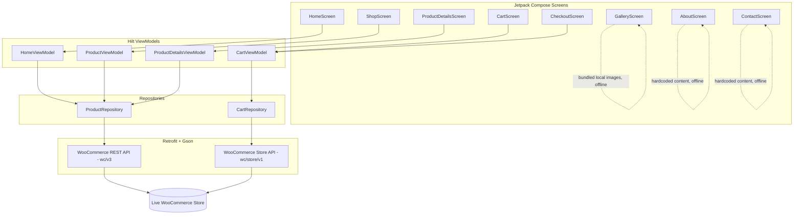

# Architecture

```mermaid
flowchart TD
    subgraph Screens[Jetpack Compose Screens]
        Home[HomeScreen]
        Shop[ShopScreen]
        ProductDetails[ProductDetailsScreen]
        Cart[CartScreen]
        Checkout[CheckoutScreen]
        Gallery[GalleryScreen]
        About[AboutScreen]
        ContactS[ContactScreen]
    end

    subgraph ViewModels[Hilt ViewModels]
        HomeVM[HomeViewModel]
        ProductVM[ProductViewModel]
        ProductDetailsVM[ProductDetailsViewModel]
        CartVM[CartViewModel]
    end

    subgraph Repos[Repositories]
        ProductRepo[ProductRepository]
        CartRepo[CartRepository]
    end

    subgraph Network[Retrofit + Gson]
        WooApi[WooCommerce REST API - wc/v3]
        StoreApi[WooCommerce Store API - wc/store/v1]
    end

    Home --> HomeVM
    Shop --> ProductVM
    ProductDetails --> ProductDetailsVM
    Cart --> CartVM
    Checkout --> CartVM

    Gallery -.bundled local images, offline.-> Gallery
    About -.hardcoded content, offline.-> About
    ContactS -.hardcoded content, offline.-> ContactS

    HomeVM --> ProductRepo
    ProductVM --> ProductRepo
    ProductDetailsVM --> ProductRepo
    CartVM --> CartRepo

    ProductRepo --> WooApi
    CartRepo --> StoreApi

    WooApi --> Store[(Live WooCommerce Store)]
    StoreApi --> Store
```
